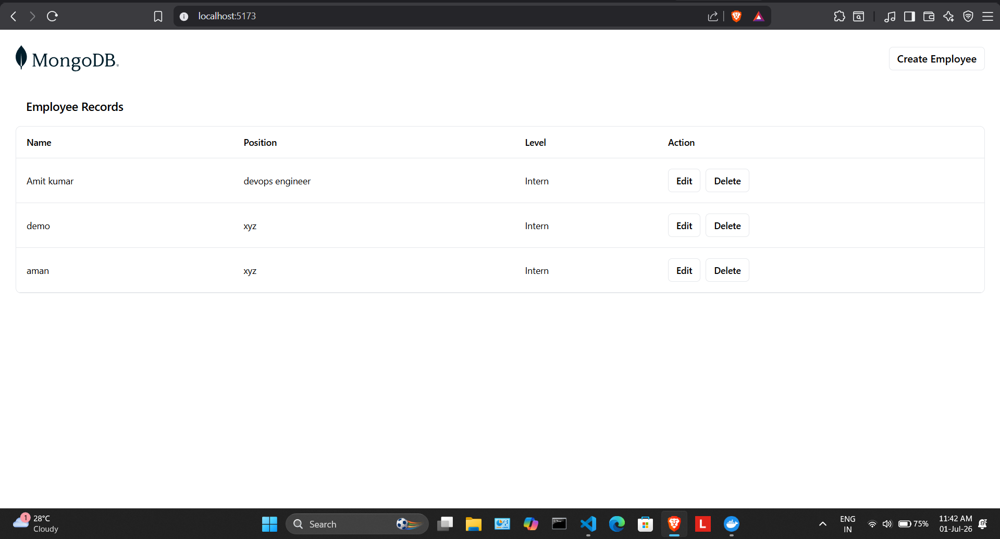
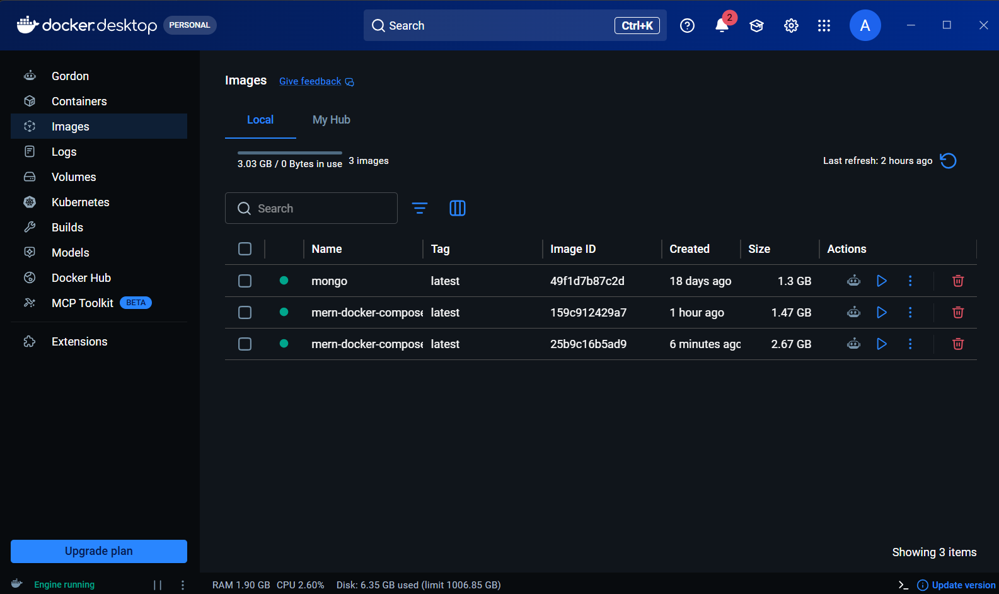
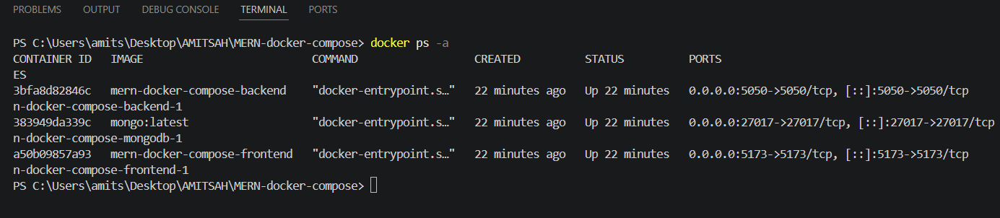

<div align="center">

# 🚀 MERN Stack Application using Docker & Docker Compose

<p align="center">
Containerizing a Full Stack MERN Application with Docker, Docker Networking & Docker Compose
</p>

<p align="center">


</p>

<p align="center">

⭐ Star this repository if you found it useful!

</p>

</div>

---

# 📌 About

This project demonstrates how to containerize a complete **MERN Stack Application** using **Docker** and **Docker Compose**.

It covers the complete workflow from building Docker images to deploying multiple containers that communicate over a custom Docker network.

---

# ✨ Features

- 🚀 React Frontend
- ⚡ Express Backend
- 🍃 MongoDB Database
- 🐳 Dockerized Frontend
- 🐳 Dockerized Backend
- 🌐 Custom Docker Network
- 💾 Persistent MongoDB Volume
- 📦 Docker Compose
- 🔥 Multi Container Architecture
- 📂 Clean Project Structure

---

# 🏗 Architecture

                   ┌──────────────────────────────┐
                   │         Docker Host          │
                   └──────────────────────────────┘
                               │
         ┌─────────────────────┼─────────────────────┐
         │                     │                     │
         ▼                     ▼                     ▼
   ┌─────────────┐      ┌─────────────┐      ┌─────────────┐
   │  Frontend   │─────▶│   Backend   │─────▶│   MongoDB   │
   │ React/Vite  │      │ Express API │      │  Database   │
   └─────────────┘      └─────────────┘      └─────────────┘
             \_____________________________________/
                     Docker Bridge Network


# 📁 Project Structure

```text
MERN-docker-compose
│
├── docker-compose.yaml
│
├── mern
│   ├── frontend
│   │     ├── Dockerfile
│   │     ├── package.json
│   │     └── src
│   │
│   └── backend
│         ├── Dockerfile
│         ├── package.json
│         └── server.js
│
├── assets
│     ├── architecture.png
│     ├── frontend.png
│     ├── docker-desktop.png
│     └── containers.png
│
└── README.md
```

---

# 🛠 Tech Stack

| Technology | Purpose |
|------------|---------|
| React | Frontend |
| Vite | Frontend Build Tool |
| Express | Backend |
| Node.js | Runtime |
| MongoDB | Database |
| Docker | Containerization |
| Docker Compose | Multi Container Management |

---

# ⚙ Prerequisites

- Docker Desktop
- Docker Compose
- Git

Verify installation

```bash
docker --version
docker compose version
git --version
```

---

# 🐳 Manual Docker Setup

## 1️⃣ Create Docker Network

```bash
docker network create demo
```

---

## 2️⃣ Build Frontend

```bash
cd mern/frontend

docker build -t mern-frontend .
```

---

## 3️⃣ Run Frontend

```bash
docker run \
--name frontend \
--network demo \
-d \
-p 5173:5173 \
mern-frontend
```

Open

```
http://localhost:5173
```

---

## 4️⃣ Run MongoDB

```bash
docker run \
--name mongodb \
--network demo \
-d \
-p 27017:27017 \
-v mongo-data:/data/db \
mongo:latest
```

---

## 5️⃣ Build Backend

```bash
cd ../backend

docker build -t mern-backend .
```

---

## 6️⃣ Run Backend

```bash
docker run \
--name backend \
--network demo \
-d \
-p 5050:5050 \
mern-backend
```

Backend

```
http://localhost:5050
```

---

# 🐋 Using Docker Compose

Build and Start

```bash
docker compose up --build
```

Run in Background

```bash
docker compose up -d
```

Stop

```bash
docker compose down
```

View Containers

```bash
docker compose ps
```

Logs

```bash
docker compose logs
```

---

# 🌐 Application URLs

| Service | URL |
|----------|-----|
| Frontend | http://localhost:5173 |
| Backend | http://localhost:5050 |
| MongoDB | localhost:27017 |

---

# 📷 Screenshots

## 🖥 Frontend



```text
assets/frontend.png
```

---

## 🐳 Docker Desktop



```text
assets/docker-desktop.png
```

---

## 📦 Running Containers



```text
assets/containers.png
```

---

# 📜 Docker Commands Cheat Sheet

| Command | Description |
|----------|-------------|
| docker build -t image . | Build Image |
| docker images | Show Images |
| docker ps | Running Containers |
| docker ps -a | All Containers |
| docker run | Create Container |
| docker stop | Stop Container |
| docker restart | Restart Container |
| docker rm | Delete Container |
| docker rmi | Delete Image |
| docker network ls | List Networks |
| docker network inspect demo | Inspect Network |
| docker volume ls | List Volumes |
| docker logs container | View Logs |
| docker exec -it container bash | Open Shell |

---

# 📚 Concepts Covered

- Docker Images
- Docker Containers
- Dockerfile
- Docker Networking
- Docker Bridge Network
- Docker Volumes
- Port Mapping
- Environment Variables
- Docker Compose
- MERN Containerization

---

# 🚀 Future Enhancements

- ✅ Jenkins CI/CD
- ✅ GitHub Actions
- ✅ Nginx Reverse Proxy
- ✅ Kubernetes Deployment
- ✅ AWS EC2 Deployment
- ✅ Terraform Infrastructure

---

# 👨‍💻 Author

## Amit Kumar

🎓 B.Tech CSE Student

☁️ Cloud & DevOps Enthusiast

🐳 Docker | Kubernetes | AWS | Jenkins | Linux

### 📬 Connect with Me

GitHub

```
https://github.com/amit-451
```

LinkedIn

```
https://www.linkedin.com/in/amitkumar7549/
```

---

<div align="center">

## ⭐ If you found this project helpful, please give it a Star ⭐

Made with ❤️ by Amit Kumar

</div>